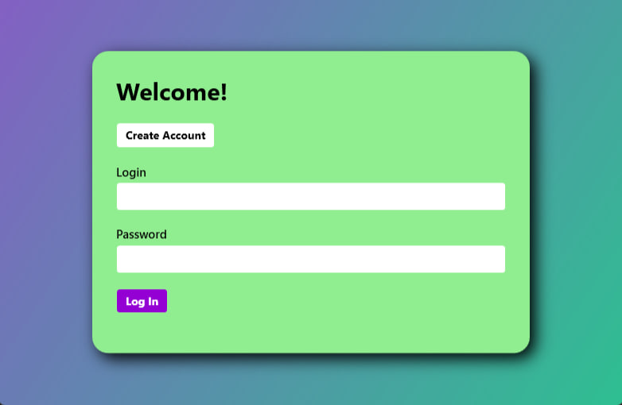
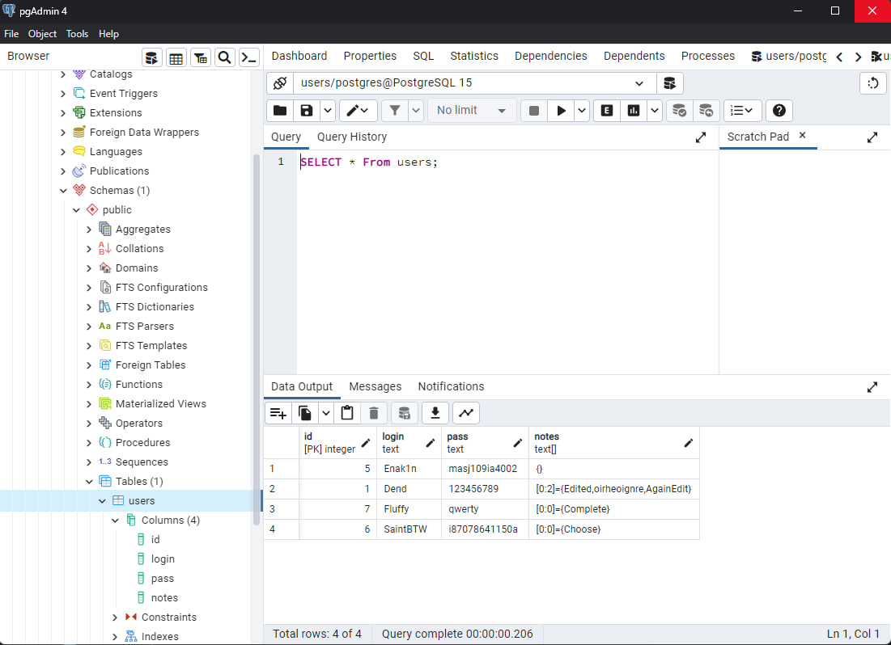
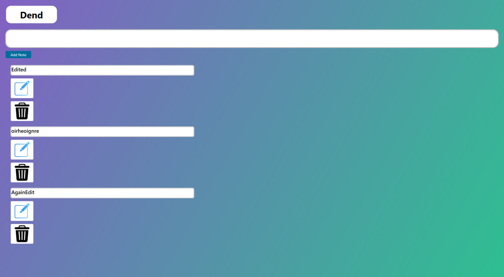

# ToDoWPF
The application give opportunity to create and edit your owns notes.
This application was created with WPF and PostgreSQL tools.

# DataBase
Data base contains for columns. Column "Notes" contains titles for unique user and show it in app.
Data base was created locally, if u want to use it, u need to create this DB in PGadmin on you PC and change connection string in App.config.

# How edit note
Because I focused on DataBase and backend part, I didn't think a lot about design and frontend.
For edit your note u need to choose item in ListBox and click on Edit button, after that u see window for editing.

## Stack 
 - C#
 - WPF
 - PostgreSQL
 - EntityFrameWork(a bit)
